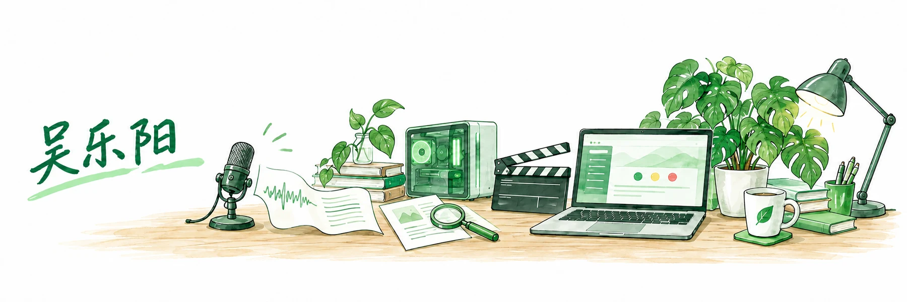
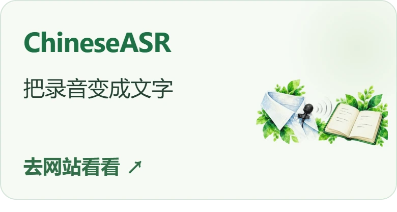
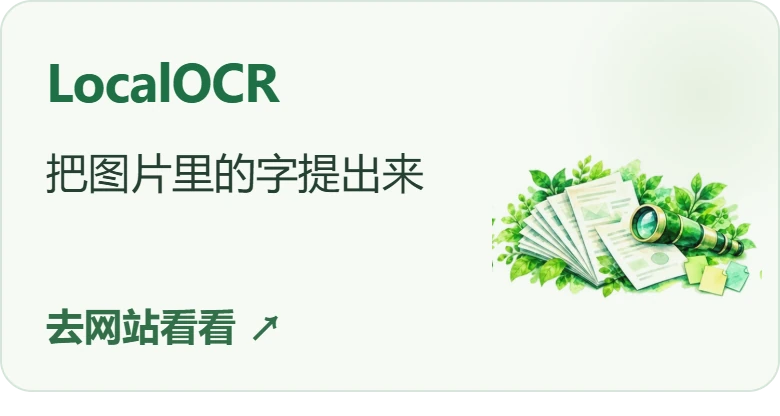
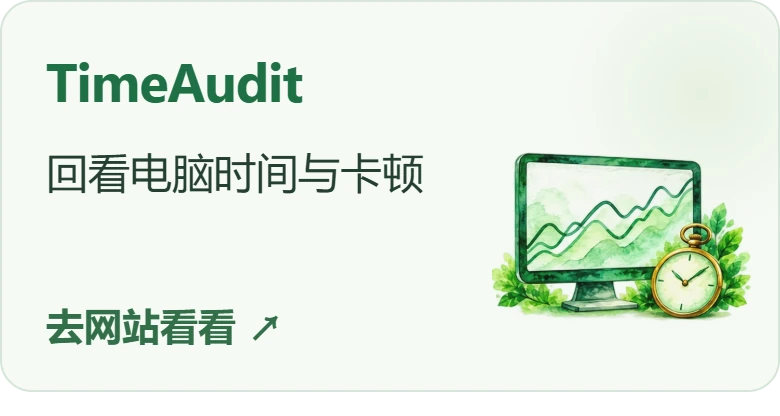
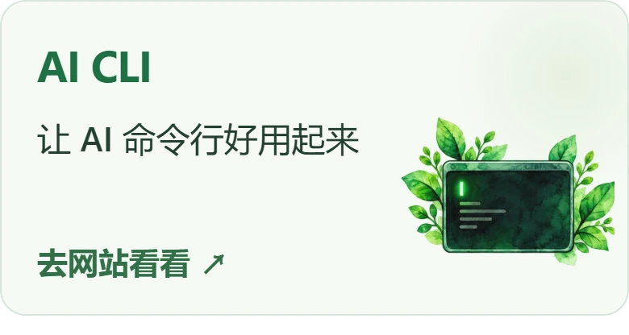
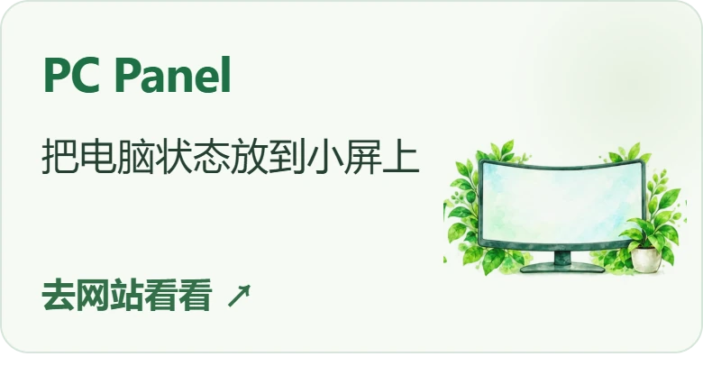

  <a href="https://wly0829.cn/"><picture>
    <source media="(prefers-color-scheme: dark)" srcset="./assets/profile-banner-dark.webp">
    
  </picture></a>

Java 出身，现在的乐趣是让 AI 替我把电脑和日常打理好。

<a href="https://wly0829.cn/">逛逛我的网站 ↗</a>

### 做点日常用得上的东西

<!-- FEATURED_PROJECTS:START -->

  <a href="https://wly0829.cn/projects/chinese-asr/"><picture><source media="(prefers-color-scheme: dark)" srcset="./assets/profile-v2/chinese-asr-dark.webp"></picture></a>
  <a href="https://wly0829.cn/projects/localocr/"><picture><source media="(prefers-color-scheme: dark)" srcset="./assets/profile-v2/localocr-dark.webp"></picture></a>

  <a href="https://wly0829.cn/projects/timeaudit/"><picture><source media="(prefers-color-scheme: dark)" srcset="./assets/profile-v2/timeaudit-dark.webp"></picture></a>
  <a href="https://wly0829.cn/projects/ai-cli-profile-manager/"><picture><source media="(prefers-color-scheme: dark)" srcset="./assets/profile-v2/ai-cli-profile-manager-dark.webp"></picture></a>

  <a href="https://wly0829.cn/projects/pc-panel-hub/"><picture><source media="(prefers-color-scheme: dark)" srcset="./assets/profile-v2/pc-panel-hub-dark.webp"></picture></a>
  <a href="https://wly0829.cn/projects/video-scaffold/"><picture><source media="(prefers-color-scheme: dark)" srcset="./assets/profile-v2/video-scaffold-dark.webp"></picture></a>

<!-- FEATURED_PROJECTS:END -->

打开项目源码

[ChineseASR](https://github.com/wlyaaaaa/ChineseASR) · [LocalOCR](https://github.com/wlyaaaaa/LocalOCR) · [TimeAudit](https://github.com/wlyaaaaa/TimeAudit) · [AI CLI](https://github.com/wlyaaaaa/ai-cli-profile-manager) · [PC Panel](https://github.com/wlyaaaaa/PC-Panel-Hub) · [Video Scaffold](https://github.com/wlyaaaaa/video-scaffold)

### 留一点折腾的足迹

  <picture>
    <source media="(prefers-color-scheme: dark)" srcset="https://raw.githubusercontent.com/wlyaaaaa/wlyaaaaa/output/github-contribution-grid-snake-dark.svg?v=watercolor-2">
    
  </picture>

从左到右，一周一周往前，走到今天再重新开始。

<a href="https://wly0829.cn/projects/">去网站看完整介绍 ↗</a>

